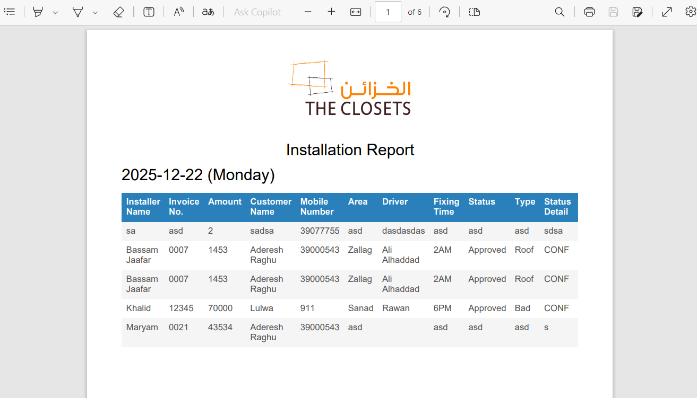

# The Closets International - Operations Task Management Frontend

This project is the frontend of the Operations Task Management system for The Closets International. It is designed to facilitate the operations department in managing their tasks efficiently. The application allows users to insert new tasks, edit existing tasks, and delete tasks as needed. Additionally, it enables tracking and displaying of all task data and provides an option to export the data to PDF format for easy reporting and sharing.

## Features

- **Task Management**: Add, edit, and delete tasks effortlessly.
- **Data Tracking**: View and track all tasks data in an organized manner.
- **Export to PDF**: Export tasks data to PDF format for reporting and sharing.
- **Date Range Filtering**: Filter tasks by selecting a date range.
- **Responsive Design**: Access the application on various devices with a responsive user interface.

## Technologies Used

- React
- CSS
- date-fns
- jsPDF
- react-router-dom

## License

This project is licensed under the MIT License.

## Screenshots

## Backend
https://github.com/matmood-dev/Operation-Nodejs
